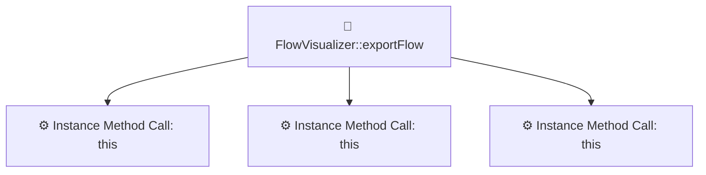

# Laravel Flow Tracer

Laravel Flow Tracer is a Laravel package for inspecting application flows from a named route, URL, or controller action. It combines route metadata with source-level analysis and can present the result in the console, as JSON, or as Graphviz and Mermaid diagrams.

## Preview

The diagram below is the Mermaid export produced by the package for `LaravelFlowTracer\Services\FlowVisualizer@exportFlow`. The checked-in source is available at [`docs/examples/flow-example.mmd`](docs/examples/flow-example.mmd).



## Features

- Trace a named route, a URL path, or a controller/action target.
- Collect route URI, HTTP methods, parameters, and middleware.
- Inspect controller methods for imported dependencies, service/action/query calls, model operations, database operations, events, and jobs.
- Trace forward and backward dependencies, calculate impact, and identify circular dependencies.
- Inspect internal method calls and optionally perform a bounded deep trace.
- Export diagrams as PNG, SVG, Graphviz DOT, or Mermaid; output the flow data as JSON for automation.
- Report project-level counts for controllers, services, models, and actions.

## Requirements

- PHP 8.1 or later.
- Laravel components 10, 11, or 12.
- [Graphviz](https://graphviz.org/) when creating PNG, SVG, or DOT exports. It is not needed for table, JSON, or Mermaid output.

## Installation

Install the package in a Laravel application:

```bash
composer require quitscope/laravel-flow-tracer
```

Laravel package discovery registers the service provider and command automatically. To customize the defaults, publish the configuration file:

```bash
php artisan vendor:publish --provider="LaravelFlowTracer\FlowTracerServiceProvider" --tag=config
```

### Install Graphviz

Graphviz provides the `dot` executable used for image and DOT exports.

```bash
# macOS (Homebrew)
brew install graphviz

# Ubuntu/Debian
sudo apt-get install graphviz

# Windows (winget)
winget install Graphviz.Graphviz
```

Verify that it is reachable from the environment running Artisan:

```bash
dot -V
```

If it is not on `PATH`, set `graphviz.dot_path` in the published configuration.

## Usage

Choose exactly one starting point:

```bash
# Named route
php artisan flow:trace --route=posts.index

# URL path (the command attempts GET, POST, PUT, PATCH, and DELETE)
php artisan flow:trace --url=/api/posts

# Controller method or invokable/action class
php artisan flow:trace --action='App\Http\Controllers\PostController@index'
```

By default, the command prints a table and writes a PNG below `storage/app/flow-diagrams`. Add `--no-png` when Graphviz is unavailable or when only structured output is needed.

### Command options

| Option | Description |
| --- | --- |
| `--action=` | Trace a controller action or class. Accepts `Class@method`; an omitted method is resolved as an invokable/action method when possible. |
| `--route=` | Trace a named Laravel route. |
| `--url=` | Trace a URL path. |
| `--forward` | Include the forward dependency tree for the traced controller. |
| `--backward` | Include classes that depend on the traced controller. |
| `--impact` | Include forward/backward impact counts and a risk level. |
| `--circular` | Search the dependency graph for circular dependencies. |
| `--depth=3` | Maximum depth used by forward and backward dependency tracing. |
| `--format=table` | Console format: `table` or `json`. |
| `--export=` | Additional export format: `png`, `svg`, `dot`, or `mermaid`. |
| `--no-png` | Do not create the automatic PNG output. |
| `--output=` | Output file path for the automatic PNG export. |
| `--stats` | Show project statistics instead of tracing a start point. |
| `--scan=` | Directory to scan with `--stats`; otherwise the application base path is scanned. |
| `--deep` | Follow detected connections beyond the initial flow. |
| `--max-deep=10` | Maximum depth for `--deep`. |
| `--internal` | Include internal method calls and detailed operations. |
| `--show-params` | Include method parameters in internal analysis; requires `--internal`. |
| `--debug-connections` | Print diagnostic information about deep-trace connection detection. |

### JSON output

Use JSON when the result will be consumed by another tool:

```bash
php artisan flow:trace --route=posts.index --format=json --no-png
```

The JSON document contains the start point, route and middleware metadata when present, controller/action, detected services and models, database operations, events, jobs, and any requested dependency analysis.

### Diagram output

The command writes a PNG by default. Set a destination explicitly when it should be retained as project documentation:

```bash
php artisan flow:trace --route=posts.index --output=docs/flow-posts-index.png
```

Create an additional format with `--export`:

```bash
php artisan flow:trace --route=posts.index --export=svg
php artisan flow:trace --route=posts.index --export=dot
php artisan flow:trace --route=posts.index --export=mermaid --no-png
```

`--output` controls the automatic PNG. Additional exports use the package's default directory, `storage/app/flow-diagrams`.

## Configuration

The published `config/flow-tracer.php` supports these settings:

| Key | Default | Purpose |
| --- | --- | --- |
| `output_directory` | `storage_path('app/flow-diagrams')` | Default diagram directory. |
| `graphviz.dot_path` | `null` | Explicit path to `dot`; `null` uses platform detection. |
| `graphviz.dpi` | `300` | Graphviz rasterization DPI. |
| `graphviz.size` | `null` | Optional Graphviz size argument. |
| `search_paths` | `app`, `src` | Application paths intended for source discovery. |
| `styling` | node, edge, and graph values | Visual defaults for generated diagrams. |
| `max_depth` | `3` | Configured analysis-depth default. |
| `features` | enabled flags | Feature flags for PNG generation, caller detection, dependency analysis, and model relationships. |

## Supported application structures

The tracer discovers conventional Laravel controllers under `App\Http\Controllers` and searches common source roots including `app`, `src`, `Application`, `Domain`, `domain`, `lib`, and `packages` when resolving classes. Source analysis recognizes class names and imports that follow common Controller, Service, Action, Query, Repository, Handler, and Model naming conventions. This makes it suitable for conventional Laravel applications as well as applications that organize domain or application code in separate source directories.

## Example

To inspect a route, add dependency context, and avoid writing an image during an exploratory run:

```bash
php artisan flow:trace --route=posts.index --forward --depth=2 --internal --no-png
```

For project-level statistics:

```bash
php artisan flow:trace --stats --scan=app
```

## Tests

Run the package test suite after installing development dependencies:

```bash
composer test
```

If your application does not define a Composer `test` script, invoke PHPUnit directly:

```bash
vendor/bin/phpunit
```

## Contributing

Contributions are welcome. Please open an issue for substantial changes, keep pull requests focused, add or update tests for behavior changes, and run the test suite before submitting a pull request.

## License

Laravel Flow Tracer is released under the [MIT License](LICENSE.md).
