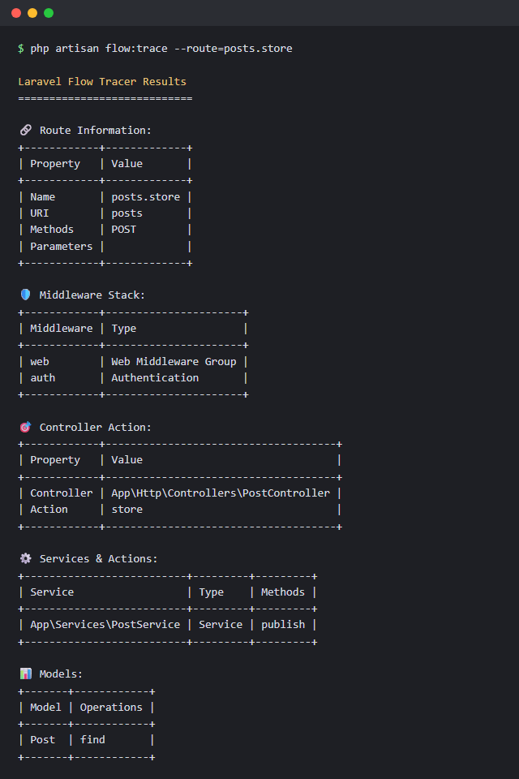
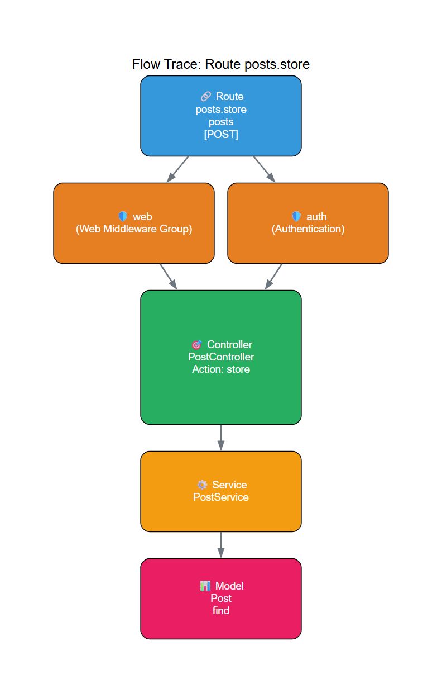

# Laravel Flow Tracer

An Artisan command that shows what happens behind a route: which middleware runs, which controller method handles it, and which services and models that method touches. You get the result as a table, as JSON, or as a diagram.

I built it because I kept opening five files just to answer "what does this endpoint actually do?" in larger projects. Now it's one command.

<p align="center">
  
  &nbsp;
  
</p>

## Requirements

- PHP 8.1+
- Laravel 10, 11 or 12
- [Graphviz](https://graphviz.org/download/) for PNG, SVG and DOT output. Table, JSON and Mermaid work without it.

## Installation

```bash
composer require quitscope/laravel-flow-tracer --dev
```

The service provider is registered through package discovery.

Graphviz, if you want images:

```bash
brew install graphviz            # macOS
sudo apt-get install graphviz    # Debian/Ubuntu
winget install Graphviz.Graphviz # Windows
```

Check it with `dot -V`. On Windows the package looks for `C:\Program Files\Graphviz\bin\dot.exe`, everywhere else it calls `dot` from your `PATH`. If yours lives somewhere else, publish the config and set `graphviz.dot_path`.

## Usage

Pick a starting point:

```bash
php artisan flow:trace --route=posts.store
php artisan flow:trace --url=/api/posts
php artisan flow:trace --action='App\Http\Controllers\PostController@store'
```

By default this prints the tables and writes a PNG to `storage/app/flow-diagrams`. Skip the image with `--no-png`.

Some more examples:

```bash
# JSON, e.g. for scripts
php artisan flow:trace --route=posts.store --format=json --no-png

# Save the diagram somewhere specific
php artisan flow:trace --route=posts.store --output=docs/posts-store.png

# Other formats (written to the output directory)
php artisan flow:trace --route=posts.store --export=svg
php artisan flow:trace --route=posts.store --export=mermaid --no-png

# Who depends on this controller, and what does it depend on?
php artisan flow:trace --route=posts.store --forward --backward --impact

# Rough numbers for the whole project
php artisan flow:trace --stats
```

The Mermaid output for the screenshot above is in [`docs/examples/flow-example.mmd`](docs/examples/flow-example.mmd). GitHub renders it if you put it in a `mermaid` code block.

### All options

| Option | What it does |
| --- | --- |
| `--route=` | Trace a named route |
| `--url=` | Trace a URL path (tries GET, POST, PUT, PATCH, DELETE) |
| `--action=` | Trace `Class@method`, or an invokable class |
| `--format=` | `table` (default) or `json` |
| `--no-png` | Don't write the default PNG |
| `--output=` | Path for the default PNG |
| `--export=` | Extra output: `png`, `svg`, `dot` or `mermaid` |
| `--forward` | Classes the controller depends on |
| `--backward` | Classes that depend on the controller |
| `--impact` | Dependency counts and a risk level |
| `--circular` | Look for circular dependencies |
| `--depth=3` | Depth for `--forward` / `--backward` |
| `--internal` | Show internal method calls of the controller method |
| `--show-params` | Include parameters (with `--internal`) |
| `--deep` | Keep following detected classes |
| `--max-deep=10` | Limit for `--deep` |
| `--stats` | Count controllers, services, models and actions |
| `--scan=` | Directory for `--stats` (defaults to the project root) |
| `--debug-connections` | Print what `--deep` detects and why |

## Configuration

```bash
php artisan vendor:publish --provider="LaravelFlowTracer\FlowTracerServiceProvider" --tag=config
```

The settings that matter:

| Key | Default |
| --- | --- |
| `output_directory` | `storage_path('app/flow-diagrams')` |
| `graphviz.dot_path` | `null` (auto) |
| `graphviz.dpi` | `300` |
| `graphviz.size` | `null` |

## How it works (and where it falls short)

The route part comes straight from Laravel's router, so route, middleware and controller are exact. Everything below the controller is found by reading the source of the controller method: constructor dependencies, `new SomethingService()`, `SomethingAction::run()`, `Model::find()` and so on. Classes are recognised by name suffixes like `Service`, `Action`, `Query`, `Repository` and `Handler`.

So this is a static, best-effort view. Calls behind facades, container lookups or dynamic method names won't show up, and classes that don't follow those naming conventions can be missed. For getting an overview of an unfamiliar codebase it has been good enough for me. Issues and PRs for better detection are welcome.

## Troubleshooting

**Image export fails with "cannot find the path" or "dot: command not found"**
Graphviz isn't installed or not where the package expects it. Set `graphviz.dot_path`, or use `--no-png`.

**"Route ... not found"**
`--route` wants the route name, not the URI. Use `--url` for paths. `php artisan route:list` shows both.

**Out of memory on big projects**
`php -d memory_limit=512M artisan flow:trace ...`

## Tests

```bash
composer install
composer test
```

## License

MIT, see [LICENSE.md](LICENSE.md).
